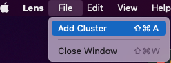
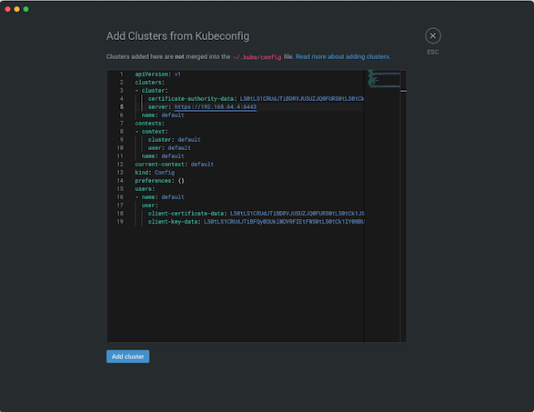
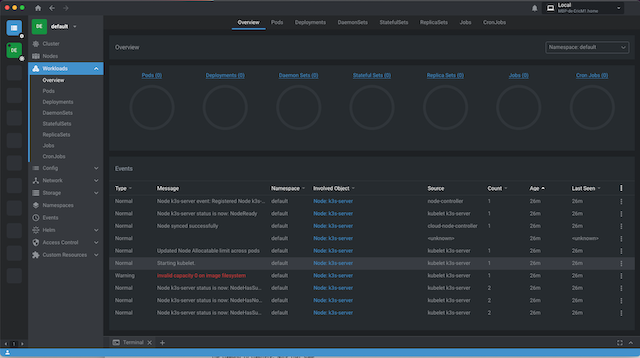

# Créer votre cluster pour bien commencer

Pour permettre de mettre en place votre environnement de travail avec un cluster kubernetes. Un choix assez large d'options est disponible, cet article propose plusieurs approches pour créer le votre.
Il vous permet de construire un cluster et progressivement utiliser une chaine de livraison logicielle compatible avec l'offre Cloud Pi Native proposée par le ministère de l'Intérieur. Il vous faudra respecter quelques conditions ou adapter votre code au choix de processeur, rootless, liste des images de références. Cf. liste de compatibilité citée en annexes.

Pour découvrir la conteneurisation et Kubernetes, vous pouvez suivre des tutoriaux tels que ceux présents au sein de ce répertoire github, ainsi qu'à travers une offre de tutoriaux vidéo en ligne. Tel que ceux proposés par "Tech With Nana" (Activer la traduction des sous titre dans YouTube) :
https://www.youtube.com/watch?v=VnvRFRk_51k ( acculturation rapide de 15 min )
https://www.youtube.com/watch?v=s_o8dwzRlu4 ( 'crash course' en 1H )
https://www.youtube.com/watch?v=X48VuDVv0do ( court complet 4H )

Vous disposer de plusieurs possibilités pour monter votre environnement, dans le cloud ou en local. Vous commencerez probablement sur votre poste de travail et irez ensuite vers une combinaison hybride :

##### 1. Monter votre cluster sur votre poste de travail : (commencez par celle-ci)
L'option généralement la plus confortable pour débuter ou pour un développeur.
Pré-requis : un ordinateur Mac ou Unix (PC possible) avec à minima 8Go de RAM et plusieurs processeurs.
Note: Cet article a été réalisé à partir de MacBook Pro 'M1' (processeur de type Arm) et testé sur des VM linux Ubuntu Arm.
Là vous disposer de plusieurs options également.
- Installer **DockerDestop** : permet d'activer simultanément l'ensembles des outils docker et d'un minicluster kubernetes.
(peux nécessiter une licence)
- Installer un **cluster minishift** une version réduite en appel à ressource, sur Mac et PC vous devez disposer de la capacité d'exécution de VM tel que par exemple : https://multipass.run/, suivez les instructions pour l'installation, cela s'installe comme un charme.

  ```
  # Permet de lancer un mini cluster kubernetes (8Go Ram, 5 vcpu, 60G de disque)
  multipass launch lts --name k3s-server  -m 8g -c 5 -d 60G

  # Attendre quelques minutes puis lancer la commande suivante
  multipass exec my-first-kube -- lsb_release -a

  ```

- Installer un **cluster K3s**, version de kubernetes économe en ressource cf. https://k3s.io/

Sur Mac et PC vous devez disposer de la capacité d'exécution de VM linux, vous pouvez utiliser  https://multipass.run/, suivez les instructions pour l'installation, cela s'installe comme un charme.

```
# Puis... pour installer une VM pour le cluster
multipass launch lts --name k3s-server  -m 8g -c 5 -d 60G

# (Pui) Installer un master k3s avec les droits d'accès sur l'ensemble des utilisateurs
multipass shell k3s-server
sudo curl -sfL https://get.k3s.io | sh -s - --write-kubeconfig-mode 644

# Vérifier la disponibilité du worker node.
  ubuntu@k3s-server:~$   kubectl get nodes
  NAME         STATUS   ROLES                  AGE     VERSION
  k3s-server   Ready    control-plane,master   3m25s   v1.25.4+k3s1

  ubuntu@k3s-server:~$ kubectl get pods -A
  NAMESPACE     NAME                                      READY   STATUS      RESTARTS   AGE
  kube-system   local-path-provisioner-79f67d76f8-nkslg   1/1     Running     0          3m47s
  kube-system   coredns-597584b69b-g9h4m                  1/1     Running     0          3m47s
  kube-system   helm-install-traefik-crd-frxpb            0/1     Completed   0          3m47s
  kube-system   svclb-traefik-162592aa-zzfqb              2/2     Running     0          3m38s
  kube-system   helm-install-traefik-h276n                0/1     Completed   1          3m47s
  kube-system   traefik-bb69b68cd-x257d                   1/1     Running     0          3m38s
  kube-system   metrics-server-5c8978b444-g55zj           1/1     Running     0          3m47s
```
  ###### Préparer l'utilisation de votre cluster

```
 #Rechercher l'ip locale de votre machine dans le haut de la fenêtres en déroulant vers le haut
 Welcome to Ubuntu 22.04.1 LTS (GNU/Linux 5.15.0-56-generic aarch64)

  * Documentation:  https://help.ubuntu.com
  * Management:     https://landscape.canonical.com
  * Support:        https://ubuntu.com/advantage

   System information as of Wed Dec 28 18:43:32 CET 2022

   System load:             1.35009765625
   Usage of /:              4.0% of 57.97GB
   Memory usage:            9%
   Swap usage:              0%
   Processes:               157
   Users logged in:         1
   IPv4 address for cni0:   10.42.0.1
*> IPv4 address for enp0s1: 192.168.64.4 <**********************
   IPv6 address for enp0s1: fd12:d3ea:b18f:437b:5054:ff:fecd:9738
```

  ###### Gérer son cluster

```
#Ensuite vous pouvez installer **Lens** https://k8slens.dev/ pour facilement 'monitorer' votre cluster.
  # récupérer le fichier de configuration
  cat /etc/rancher/k3s/k3s.yaml

    apiVersion: v1
    clusters:
    - cluster:
        certificate-authority-data: LS0t
    etc..... etc..... etc.....
```
  Ajouter un nouveau cluster :



 Copier le convenu du 'cat' dans la nouvelle fenêtre et changez l'ip par celle identifiée plus haut,



Cela crée une nouvelle entrée et vous pouvez ensuite vous connecter à votre cluster localement




```
  # a tout fin utile vous pourrez récupérer le token avec la commande suivante : ( vous en aurez besoin pour plus tard )
    sudo cat /var/lib/rancher/k3s/server/token
```


- Installer Minishift ( version local d'openshift, type cluster utilisé par le ministère de l'Intérieur )
<< A FAIRE >>

##### 2. Utiliser un ou plusieurs clusters (managés) dans le cloud, la plus facile ) :
- Pour exposer votre application vers ses usagers ;
- Séparer l'environnement d'exécution du poste de travail du développeur ;
- Travailler en groupe ;
- Attention cela nécessite une souscription.

L'avantage est que vous n'avez pas à gérer votre cluster si à maitriser tous les concepts d'infratructure. Généralement ces services sont disponibles avec des processeurs x86-64 ou AMD-64.
Les offre sous processeurs Arm sont généralement assez rare sauf à prendre des Mac 'M1'.

Pour démarrer vous pouvez utiliser des comptes d'évaluation valable quelques mois, l'ensemble des 'hyperscalers' proposent cette option.

##### 3. Monter votre propre cluster 'on premise' (pour les plus curieux) ;
Idem point précédent. C'est l'approche idéale pour se 'faire la main' et comprendre les principes fondamentaux de kubernetes y compris l'approche 'baremetal'.

- Vous considèrerez recycler des serveurs un peu anciens pour vous faire la main, si les disques sont un peu anciens changez les par des versions SSD plus rapide et fiable. Il faut généralement >16 Go de Ram et assurez-vous que les versions récentes des OS linux (debian, ubuntu) contiennent les drivers matériels appropriés pour votre serveur et que le/les processeurs est/sont 64bits. https://www.debian.org/ports/
Il faut idéalement en prévoir 2-3 pour une configuration 'pédagogique'.
- Vous pouvez également monter un cluster à partir de microcomputeurs de type RaspberryPi, privilégiez des modules à 8 Go de Ram. Ces petits serveurs sont assez performants et surtout ils utilisent des processeurs 'Arm' beaucoup moins consommateur d'énergie.
```
note : si raspeberyPi penser à ajouter cgroup_enable=cpuset cgroup_enable=memory cgroup_memory=1 en fin du fichier /boot/cmdline.txt avec la cmd suivante :
sudo vi /boot/cmdline.txt
```
